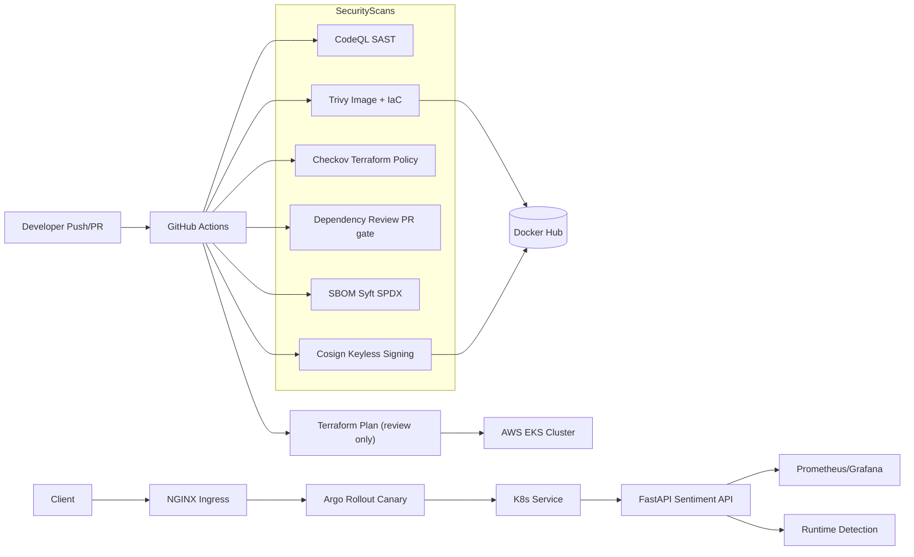

# 🚀 Securing AI - DevSecOps Demonstration V2

This repository demonstrates a **secure CI/CD pipeline** for a FastAPI-based ML service (now using **VADER sentiment analysis** for lightweight inference).  

It integrates:

- **SAST** → CodeQL  
- **SCA** → Trivy (Docker image & Terraform IaC)  
- **Policy-as-Code** → Checkov  
- **SBOM** → Syft SPDX JSON  
- **Supply Chain Security** → Cosign (keyless signing, OIDC)  
- **Runtime Security** → Falco  
- **Observability** → Prometheus & Grafana  
- **Deployment** → Argo Rollouts with Canary strategy + signature verification

## 🔄 Evolution: V1 → V2

This project originally started as **V1** (FastAPI + Hugging Face Transformers + ECS Fargate) and evolved into **V2** (FastAPI + VADER + EKS) with stronger DevSecOps practices.

### Key Changes

- **Switched from Hugging Face Transformers → VADER sentiment analysis**
  - Hugging Face added 1GB+ image size, slow builds, heavy dependencies.
  - VADER is lightweight (~20MB), keeps demo fast & reproducible.
  - Showcases ability to **optimise for security & performance**.

- **ECS → EKS migration**
  - Kubernetes offers advanced deployment strategies (Argo Rollouts).
  - Easier integration with Prometheus, Grafana, Falco.
  - Private cluster endpoints with KMS encryption for secrets.

- **Stronger CI/CD Security**
  - Added **Checkov** for Terraform policy enforcement.
  - Added **Cosign** for container signing (keyless, GitHub OIDC).
  - Added **SBOM generation** with Syft (supply chain visibility).
  - Replaced static AWS IAM keys with **GitHub OIDC federated roles** (no long-lived secrets).

- **Runtime & Observability**
  - Added **Falco** for syscall-based intrusion detection.
  - Added **Prometheus + Grafana** for monitoring and dashboards.
  - Added **ServiceMonitor** to scrape metrics automatically.

- **Deployment**
  - Canary deployments with Argo Rollouts (progressive delivery).
  - GitHub Actions workflow automatically verifies signatures before rollout.

- **Security by Default**
  - Pods run as non-root with seccomp/AppArmor profiles.
  - NetworkPolicy restricts ingress to NGINX ingress controller.
  - JWT authentication added for API access.
  - Rate limiting & security headers integrated.

## 🏗️ Architecture

## 🔐 Security Governance

- **SAST**: CodeQL uploads SARIF to GitHub Security tab  
- **SCA**: Trivy scans Docker images & Terraform IaC  
- **Policy-as-Code**: Checkov enforces Terraform best practices  
- **SBOM**: Syft generates SPDX JSON artifacts (auditable)  
- **Supply Chain Security**: Cosign signs/publishes container images keylessly  
- **Runtime Security**: Falco monitors system calls for suspicious activity  
- **Observability**: Prometheus + Grafana integrated for metrics & dashboards  
- **Deployment Controls**: Argo Rollouts verifies signed images before rollout  
- **Identity & Access**: GitHub Actions authenticates to AWS using **OIDC federated roles**, eliminating static AWS secrets.

## ⚙️ Tech Stack

- **API**: Python 3.11, FastAPI, VADER sentiment analysis  
- **Containers**: Docker (multi-stage, slim, non-root, read-only FS)  
- **CI/CD**: GitHub Actions, least-privilege job tokens  
- **Security Tools**: CodeQL, Trivy, Checkov, Cosign, Falco, SBOM (Syft)  
- **Cloud Infra**: AWS EKS, private subnets, VPC, KMS encryption (Terraform)  
- **Observability**: Prometheus, Grafana  
- **Cloud Infra**: AWS EKS, private subnets, VPC, KMS encryption (Terraform), OIDC for AWS auth  

## 🧑‍💻 Local Development

**Build & run locally:**
```bash
docker build -t secure-ml-api:latest .
docker run -p 8000:8000 secure-ml-api:latest

curl -sS -X POST http://localhost:8000/predict \
  -H 'Content-Type: application/json' \
  -H 'Authorization: Bearer <jwt>' \
  -d '{"text":"I love learning DevSecOps!"}'

```
Swagger UI:
http://localhost:8000/docs

## 🔑 GitHub Setup

**Secrets required:**
- `DOCKERHUB_USERNAME`  
- `DOCKERHUB_TOKEN`  

✅ AWS keys are **no longer stored in GitHub**.  
GitHub Actions uses **OIDC federation** to assume two short-lived AWS IAM roles:  
- `GitHubActions-secure-ml-ro` → Read-only Terraform plan  
- `GitHubActions-secure-ml-eks` → Deployment to EKS  

**Branch protection on `main`:**
- Require PR approval  
- Require status checks (CodeQL, Trivy, Checkov, Dependency Review)  
- Prevent unsigned containers from being deployed  

## 🔄 CI/CD Pipeline

**Triggered on push to `main`:**

1. **CodeQL** → Static code analysis (SAST)  
2. **Trivy** → Vulnerability scanning (image & IaC)  
3. **Checkov** → Terraform policy compliance  
4. **SBOM** → Generate SPDX JSON artifact  
5. **Terraform Plan** → Infra drift preview (manual apply only)  
6. **Build → Push → Sign** → Docker Hub + Cosign keyless signing (OIDC)
7. **CD Rollout** → Signature verification + Canary rollout (if cluster exists)  

## ☁️ Terraform Deployment (Optional)

```bash
cd terraform-eks
terraform init
terraform plan
terraform apply   # will provision VPC, private EKS cluster with KMS encryption
```

## 📊 Observability & Runtime Security

- **Prometheus & Grafana** → Monitoring & dashboards  
- **Falco** → Detects suspicious syscalls (e.g., reverse shells, crypto mining)  
- **ServiceMonitor** → Scrapes app metrics automatically  

## 🚀 Future Improvements

- **Secrets Management**: Centralise into Vault / AWS Secrets Manager  
- **Admission Control**: Kyverno/OPA to enforce signed images only  
- **E2E Testing**: Extend CI/CD with pytest integration tests  

 ## 📌 Notes
+ - AWS authentication is handled via **GitHub OIDC**, so no static IAM keys exist in GitHub.  
+ - Forked repositories **cannot access AWS roles/secrets**.  
+ - The pipeline is cost-conscious: rollout steps soft-skip if no EKS cluster is found.  