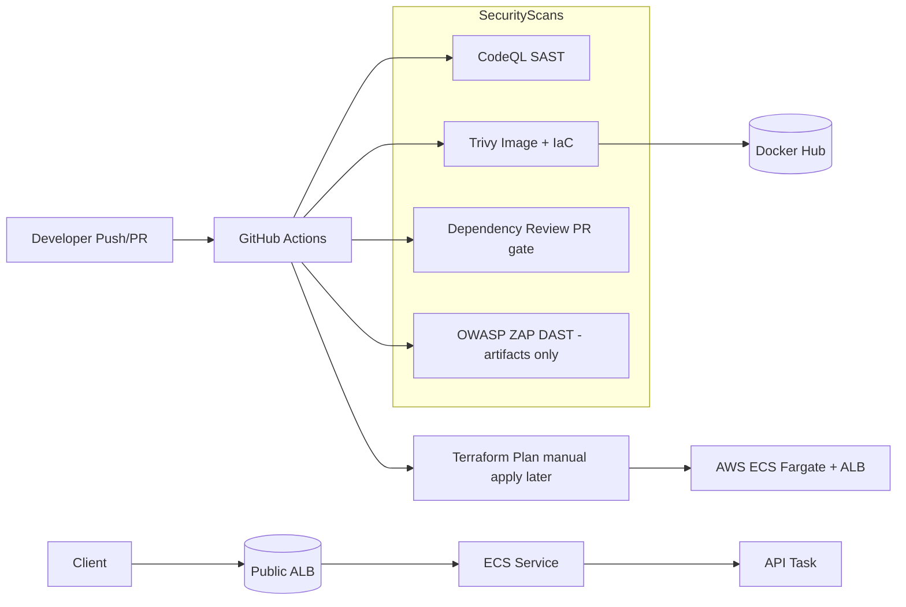

# 🚀 Securing AI - DecSecOps Demonstration V1

This repository demonstrates a **secure CI/CD pipeline** for a FastAPI-based ML service (sentiment analysis with Hugging Face).  

It integrates:

- **SAST** → CodeQL  
- **SCA** → Trivy (Docker image & Terraform IaC)  
- **DAST** → OWASP ZAP Baseline (artifacts only, no deploy)  
- **IaC** → Terraform for AWS ECS Fargate (manual apply after review)  
- **Least-privilege GitHub Actions** → Per-job token permissions  
- **Branch protection** & **Dependency Review** on PRs

---

## 🏗️ Architecture



---

## 📂 Repository Structure

```
.
├─ app/                        # FastAPI source (app/main.py)
├─ Dockerfile
├─ requirements.txt
├─ terraform-deployment/       # Terraform for ECS Fargate + ALB
│  ├─ provider.tf
│  ├─ variables.tf
│  ├─ main.tf
│  ├─ outputs.tf
│  └─ terraform.tfvars
└─ .github/workflows/
   ├─ devsecops.yml            # CodeQL + Trivy + ZAP + Terraform plan
   └─ dependency-review.yml    # PR dependency gate (optional)
```

---

## 🔐 Security Governance

- **SAST**: CodeQL uploads SARIF to Security tab → Required check.  
- **SCA**: Trivy scans image & IaC → Required check.  
- **DAST**: ZAP Baseline runs against containerised API → Artifacts uploaded.  
- **Dependency Review**: Blocks PRs introducing high/critical vulnerabilities.  
- **Change control**: CI runs `terraform plan`; `terraform apply` is manual.

---

## ⚙️ Tech Stack

- **API**: Python 3.10, FastAPI, Hugging Face Transformers  
- **Containers**: Docker  
- **CI/CD**: GitHub Actions (least privilege tokens)  
- **Security**: CodeQL, Trivy, OWASP ZAP, Dependency Review  
- **Cloud**: AWS ECS Fargate + ALB (via Terraform)

---

## 🧑‍💻 Local Development

**Build & run locally:**
```bash
docker build -t secure-ml-api:latest .
docker run -p 8000:8000 secure-ml-api:latest
```

**Test API:**
```bash
curl -sS -X POST http://localhost:8000/predict   -H 'Content-Type: application/json'   -d '{"text":"I love learning DevSecOps!"}'
```

**Swagger UI:**  
<http://localhost:8000/docs>

---

## 🔑 GitHub Setup

**Secrets required:**
- `DOCKERHUB_USERNAME`  
- `DOCKERHUB_TOKEN` (Docker Hub access token)

**Security settings:**
1. Enable **Dependency graph** and **Dependabot alerts** in repo settings.  
2. Branch protection on `main`:
   - Require PR
   - Require 1 approval
   - Require status checks: `codeql-analysis`, `trivy-scan`, `dependency-review`
   - Dismiss stale approvals on new commits

---

## 🔄 CI Pipeline

Triggered on **push** to `main` or **pull request** to `main`:

1. **CodeQL Analysis** — SAST  
2. **Trivy** — SCA on Docker image & IaC  
3. **OWASP ZAP Baseline** — DAST, artifacts only  
4. **Terraform Plan** — Output only, manual apply  
5. **Docker Push** — Pushes to Docker Hub

---

## ☁️ Terraform Deployment (Manual)

**Plan:**
```bash
cd terraform-deployment
terraform init
terraform plan
```

**Apply (after review):**
```bash
terraform apply
```

---

## 📊 OWASP ZAP Reports

Artifacts include:
- `zap-report.html`
- `zap-report.json`
- `zap-report.md`

**Download from GitHub Actions → Workflow run → Artifacts section.**

---

## 📌 Notes

- The API is deployed to **AWS ECS Fargate** with an ALB.  
- **Falco** can be integrated at runtime for container security monitoring.  
- All security tools run in CI/CD before deploy.  
- Terraform apply is **never automatic** in this setup to prevent accidental changes.

---

## 🚀 Future Improvements

While this project already demonstrates a strong DevSecOps pipeline with CI/CD, IaC, and security scanning, there are several ways it could be further improved to align with real world enterprise practices:

### 🔐 Security Enhancements
- **Centralised Secrets Management**: Move secrets from GitHub Actions into AWS Secrets Manager or HashiCorp Vault for stronger protection.  
- **Policy-as-Code**: Introduce Checkov or Terraform Sentinel to enforce compliance on Terraform configurations.

### 🛠️ Infrastructure Enhancements
- **Kubernetes (EKS) Migration**: Replace ECS with Amazon EKS (Kubernetes).  
  - Kubernetes would provide better scalability and rolling deployments.
  - Runtime security could be enhanced by integrating **Falco**, which detects abnormal system calls and intrusions.  
- **Observability Stack**: Add Prometheus & Grafana for monitoring, and either ELK Stack or AWS CloudWatch for centralised logging.  

### 🔄 CI/CD Pipeline Enhancements
- **Automated Testing**: Extend the pipeline with unit tests (via `pytest`) and integration tests to ensure functional correctness.
- **Stricter Security Gates**: Adjust the pipeline so that builds fail automatically if CodeQL, Trivy, or ZAP detect high or critical vulnerabilities.

### 🤖 Application Enhancements
- **Authentication & Authorisation**: Add JWT-based authentication to protect API endpoints.  
- **Model Management**: Use MLflow or AWS SageMaker to version, track, and serve ML models instead of relying on static Hugging Face models.

---

## What's next?

- This project isn’t done yet! I’ll be back in part 2 to roll out some of the improvements I’ve talked about!