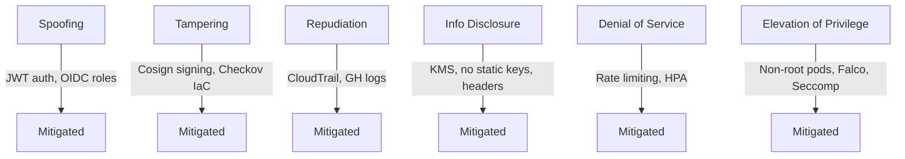

# 🛡️ Threat Model — Secure ML API (DevSecOps V2)

This document outlines the threat modeling exercise for the **Secure ML API** project, following the **STRIDE methodology** and aligning with **OWASP Top 10 (2021)**.  

The goal is to document potential threats, risks, and mitigations across the application, infrastructure, CI/CD pipeline, and runtime.

---

## 📌 System Context

- **Application**: FastAPI ML API using VADER sentiment analysis  
- **Authentication**: JWT bearer tokens (short-lived)  
- **Containerization**: Docker (slim, non-root, read-only FS)  
- **Infrastructure**: AWS EKS (private endpoints, KMS for secrets, Terraform IaC)  
- **CI/CD**: GitHub Actions (DevSecOps pipeline)  
- **Supply Chain Security**: Cosign keyless signing (GitHub OIDC)  
- **Runtime Security**: Falco (syscall monitoring)  
- **Observability**: Prometheus + Grafana  

---

## 🗂 STRIDE Threat Analysis

### 1. **Spoofing Identity**
- **Threat**: API endpoints accessed without authentication.  
- **Mitigation**: JWT-based auth, tokens signed with secret key stored in Kubernetes Secret.  

- **Threat**: CI/CD jobs impersonate trusted identities.  
- **Mitigation**: GitHub OIDC federation for AWS → short-lived IAM roles, scoped permissions.

---

### 2. **Tampering**
- **Threat**: Malicious images pushed to Docker Hub.  
- **Mitigation**: Cosign keyless signing; Argo Rollouts verifies signatures before deploy.  

- **Threat**: Terraform code modified to weaken security.  
- **Mitigation**: Checkov + Trivy scan Terraform IaC, PR dependency review enabled.

---

### 3. **Repudiation**
- **Threat**: Lack of audit logs for cluster or pipeline activity.  
- **Mitigation**:  
  - AWS CloudTrail + CloudWatch logging enabled.  
  - GitHub Actions logs retained, signed container provenance.  

---

### 4. **Information Disclosure**
- **Threat**: API leaks sensitive data (tokens, secrets).  
- **Mitigation**:  
  - Rate limiting with `slowapi`.  
  - No sensitive data in responses.  
  - Security headers enforced (CSP, Referrer-Policy, etc.).  

- **Threat**: Long-lived AWS IAM keys leaked from GitHub.  
- **Mitigation**:  
  - **Static keys eliminated**.  
  - GitHub Actions assumes AWS roles via **OIDC federation** (short-lived tokens).  
  - Forked repos **cannot access OIDC roles**.

---

### 5. **Denial of Service**
- **Threat**: Attackers flood API.  
- **Mitigation**:  
  - Rate limiting (`60/min` global, `10/min` for token issuance).  
  - HPA autoscaling for workloads.  

- **Threat**: Resource exhaustion in CI/CD (e.g., dependency bombs).  
- **Mitigation**: Timeout and job limits in workflows.

---

### 6. **Elevation of Privilege**
- **Threat**: Compromised pod escalates privileges in cluster.  
- **Mitigation**:  
  - Pods run as **non-root**, drop all Linux capabilities.  
  - Seccomp/RuntimeDefault applied.  
  - NetworkPolicy restricts ingress.  
  - Falco detects privilege escalation attempts.  

---

## 🔟 Mapping to OWASP Top 10 (2021)

| OWASP Top 10 | Risk in this project | Mitigations |
|--------------|---------------------|-------------|
| A01: Broken Access Control | Unauthorized API access | JWT auth, NetworkPolicy |
| A02: Cryptographic Failures | Weak key handling | KMS for secrets, no hardcoded keys |
| A03: Injection | Input misuse in ML model | Pydantic validation |
| A04: Insecure Design | Insecure defaults | Non-root pods, read-only FS |
| A05: Security Misconfiguration | Public EKS endpoint | Disabled, private-only |
| A06: Vulnerable & Outdated Components | Python libs | Dependabot + Trivy scans |
| A07: Identification & Auth Failures | JWT stolen/replay | Short expiry, HPA scaling |
| A08: Software/Data Integrity Failures | Malicious image deployment | Cosign signing + Argo verification |
| A09: Security Logging & Monitoring Failures | Attack visibility | CloudWatch logs, Prometheus, Falco |
| A10: SSRF | Cluster metadata abuse | No public metadata access, IAM scoped |

---

## ✅ Overall Mitigations Summary

- ✅ Migrated from **static AWS keys → GitHub OIDC** (no long-lived secrets in GitHub).  
- ✅ Containers **signed with Cosign** (keyless OIDC).  
- ✅ Argo Rollouts only deploy **verified images**.  
- ✅ EKS cluster is private-only, secrets encrypted with KMS.  
- ✅ Runtime detection with Falco.  
- ✅ Full observability via Prometheus/Grafana.  
- ✅ Defense in depth at **code → CI/CD → infra → runtime**.

---
